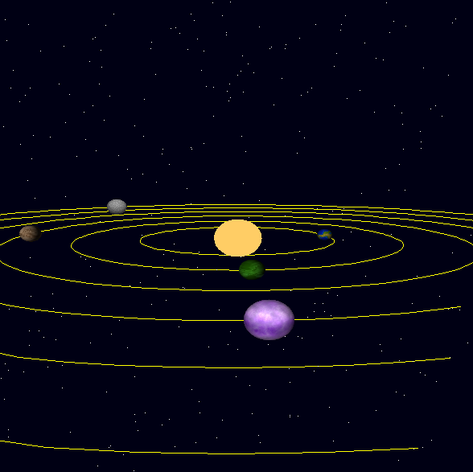
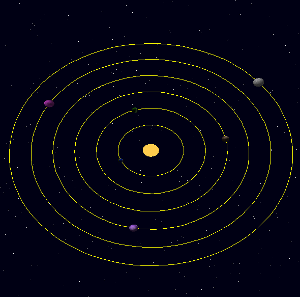
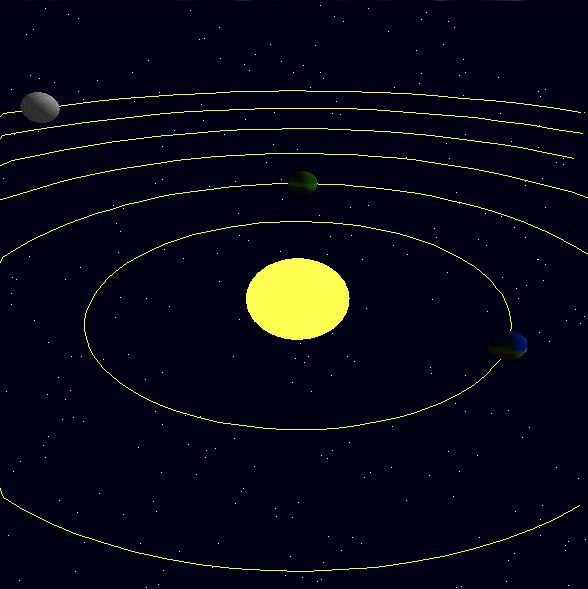

# Proyecto 03
**Gustavo Adolfo Cruz Bardales**  
**Carnet:** 22779

## Video demostrativo E Imagenes:
---
[Ver video](https://youtu.be/MHRUfPGdItQ)
---



## Controles del Sistema Solar Interactivo
---
### **Controles de Teclado**

#### **Rotación de la Cámara**
- **Tecla Derecha (`→`)**: Orbita la cámara hacia la derecha alrededor del sistema solar.
- **Tecla Izquierda (`←`)**: Orbita la cámara hacia la izquierda alrededor del sistema solar.
- **Tecla Abajo (`↓`)**: Orbita la cámara hacia abajo.
- **Tecla Arriba (`↑`)**: Orbita la cámara hacia arriba.

#### **Zoom**
- **Tecla `Q`**: Hace zoom acercando la cámara al centro del sistema solar.
- **Tecla `E`**: Hace zoom alejando la cámara del centro del sistema solar.

#### **Desplazamiento de la Vista**
- **Tecla `W`**: Mueve el punto de enfoque hacia arriba en el eje Y.
- **Tecla `S`**: Mueve el punto de enfoque hacia abajo en el eje Y.
- **Tecla `A`**: Mueve el punto de enfoque hacia la izquierda en el eje X.
- **Tecla `D`**: Mueve el punto de enfoque hacia la derecha en el eje X.

---

### **Controles de Ratón**

#### **Rotación de la Cámara**
- **Movimiento del ratón**: 
  - Arrastrar el ratón rota la cámara alrededor del sistema solar.
  - La velocidad de rotación depende del movimiento relativo del ratón.

#### **Zoom con la Rueda del Ratón**
- **Rueda del ratón**: 
  - Girar la rueda hacia adelante realiza un zoom acercando la cámara.
  - Girar la rueda hacia atrás realiza un zoom alejando la cámara.

## **Detalles Técnicos**

1. **Órbitas de la cámara**: 
   - Utilizan la función `pov.orbit(horizontal, vertical)` para calcular el nuevo ángulo de visión basado en el desplazamiento del ratón o teclas.
   
2. **Zoom**: 
   - Modifica la distancia de la cámara al centro del sistema solar con `pov.zoom(delta)`.

3. **Desplazamiento del centro**:
   - Usa `pov.move_center(direction)` para ajustar la posición del punto de enfoque según las teclas `W`, `A`, `S`, `D`.

4. **Interacción fluida con el ratón**:
   - La posición actual del ratón se compara con la posición anterior para calcular los cambios relativos y actualizar la cámara.

---

## Cómo ejecutar:
1. Clona el repositorio:
   ```bash
   git clone https://github.com/G2309/GC-PROY3.git
   cd GC-PROY3
   cargo build --release
   ./target/release/P3
   ```
